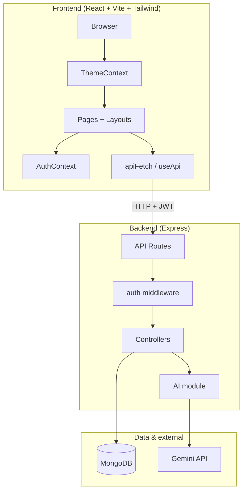
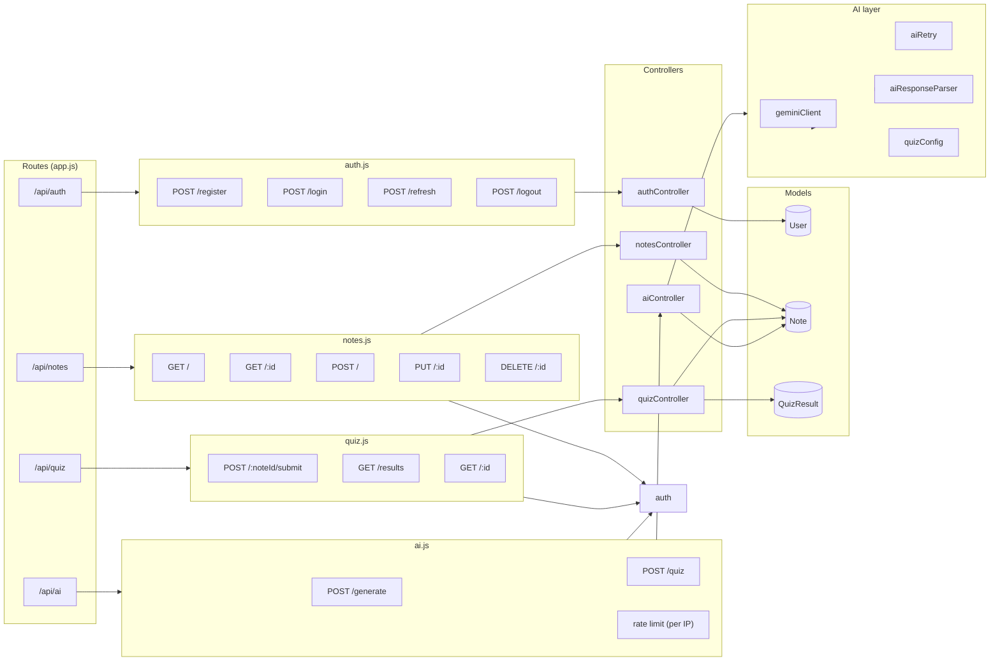
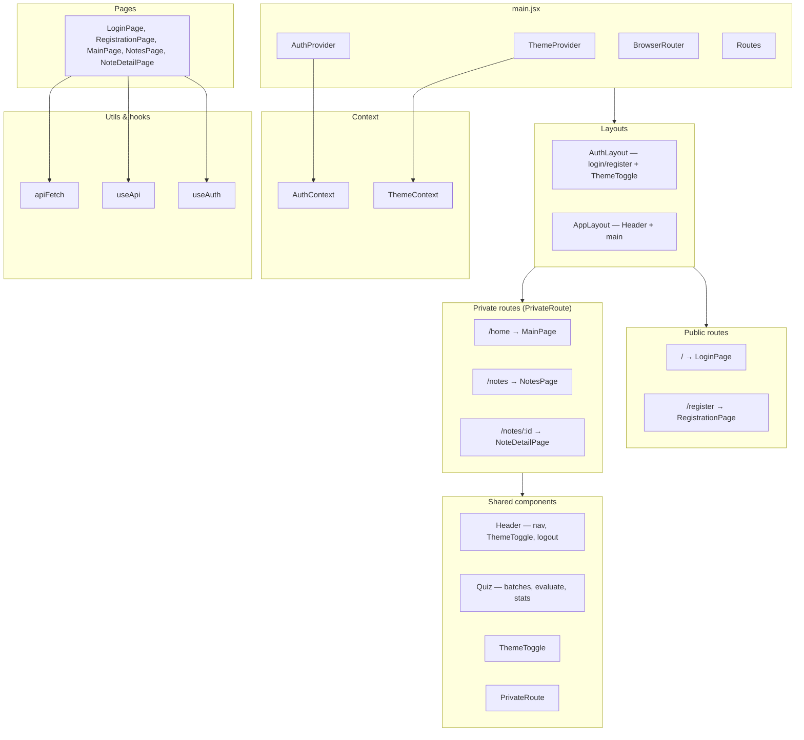
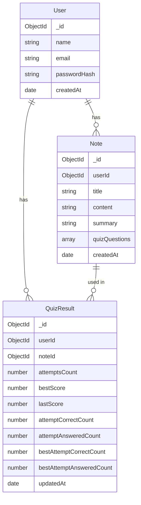
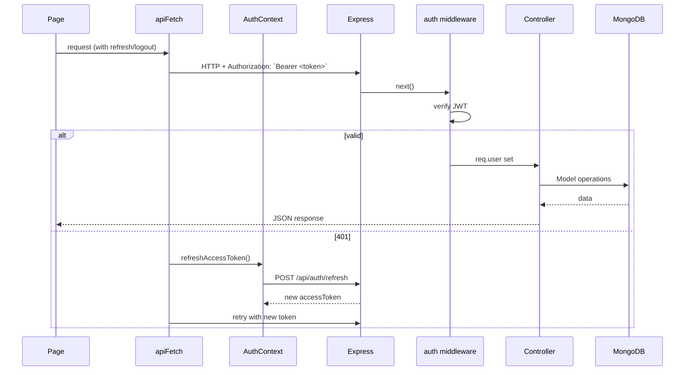

# StudyMate — Codebase Architecture

High-level and detailed views of the StudyMate application (React frontend + Express backend), aligned with the **current** repository layout.

---

## 1. System overview



**Session & theme (client):**

- **Auth:** Access token and minimal user payload are stored in `localStorage` (`studymate-access-token`, `studymate-user`). Refresh token stays in an **httpOnly** cookie. On app init, if a stored access token exists, the client skips an immediate refresh round-trip (faster load); otherwise it calls `POST /api/auth/refresh`.
- **Theme:** `ThemeProvider` toggles the `dark` class on `<html>` and persists preference in `localStorage` (`studymate-theme`). `index.html` includes a small inline script to apply `dark` before React hydrates (reduces light flash).

---

## 2. Backend structure



**Quiz submit (`POST /api/quiz/:noteId/submit`):** Accepts `answers` and `isFirstSubmission`. The backend evaluates against `note.quizQuestions`, returns `evaluatedAnswers` (including `correctAnswer` for feedback). Statistics are **cumulative per “attempt session”**: `attemptCorrectCount` / `attemptAnsweredCount` grow across batch submits until the next `isFirstSubmission: true`. `bestScore` and `bestAttemptCorrectCount` / `bestAttemptAnsweredCount` use a tie-break when percentages are equal (prefers more questions answered).

---

## 3. Frontend structure



**UI:** Tailwind `dark:` variants drive light/dark styling. Accent colors are aligned (e.g. orange in light mode, green in dark mode for primary emphasis).

---

## 4. Data model relationships



Per-note quiz answers are **not** stored as a long-lived array on `QuizResult`; the document holds aggregate stats and timestamps only. Individual evaluations are returned in the submit response for the client UI.

---

## 5. Request flow (authenticated)



---

## 6. File layout (project roots)

```
StudyMate/
├── ARCHITECTURE.md
├── README.md
├── package.json              # root devDependencies (e.g. Tailwind / PostCSS)
├── package-lock.json
├── study-mate-frontend/
│   ├── index.html              # + inline theme bootstrap (dark class)
│   └── src/
│       ├── main.jsx            # ThemeProvider, AuthProvider, routes, layouts
│       ├── App.jsx             # Minimal shell (not used as router root)
│       ├── index.css           # Tailwind entry
│       ├── contexts/
│       │   ├── AuthContext.jsx # localStorage tokens/user, refresh, init
│       │   └── ThemeContext.jsx
│       ├── layouts/
│       │   ├── AuthLayout.jsx
│       │   └── AppLayout.jsx
│       ├── components/
│       │   ├── Header.jsx
│       │   ├── PrivateRoute.jsx
│       │   ├── Quiz.jsx
│       │   └── ThemeToggle.jsx
│       ├── pages/
│       │   ├── LoginPage.jsx
│       │   ├── RegistrationPage.jsx
│       │   ├── MainPage.jsx
│       │   ├── NotesPage.jsx
│       │   └── NoteDetailPage.jsx
│       ├── hooks/
│       │   └── useApi.js
│       └── utils/
│           └── apiFetch.js
│
└── study-mate-backend/
    ├── app.js                  # Express app, CORS, route mounting
    ├── bin/www
    ├── config/
    │   ├── db.js               # MongoDB connection
    │   └── quizConfig.js       # AI quiz defaults
    ├── middleware/
    │   └── auth.js             # JWT verification
    ├── routes/
    │   ├── auth.js
    │   ├── notes.js
    │   ├── quiz.js
    │   └── ai.js
    ├── controllers/
    │   ├── authController.js
    │   ├── notesController.js
    │   ├── quizController.js
    │   └── aiController.js
    ├── models/
    │   ├── User.js
    │   ├── Note.js
    │   └── QuizResult.js
    ├── ai/
    │   ├── geminiClient.js
    │   ├── aiRetry.js
    │   └── aiResponseParser.js
    └── utils/
        └── responseHandler.js
```
