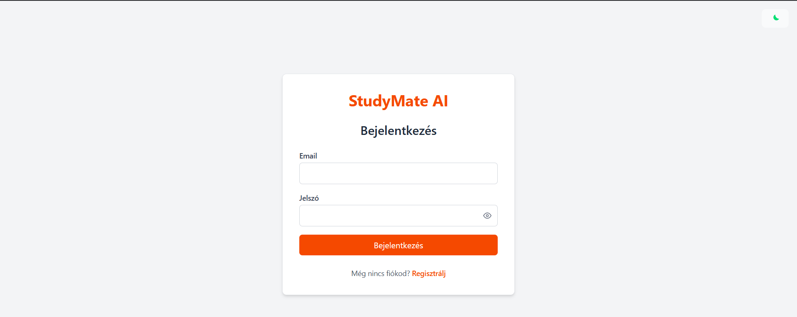
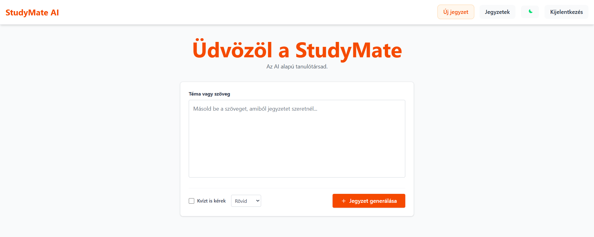
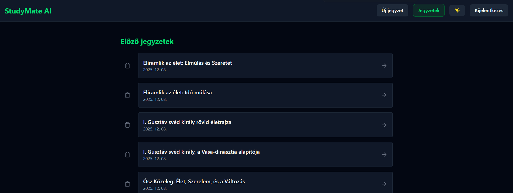
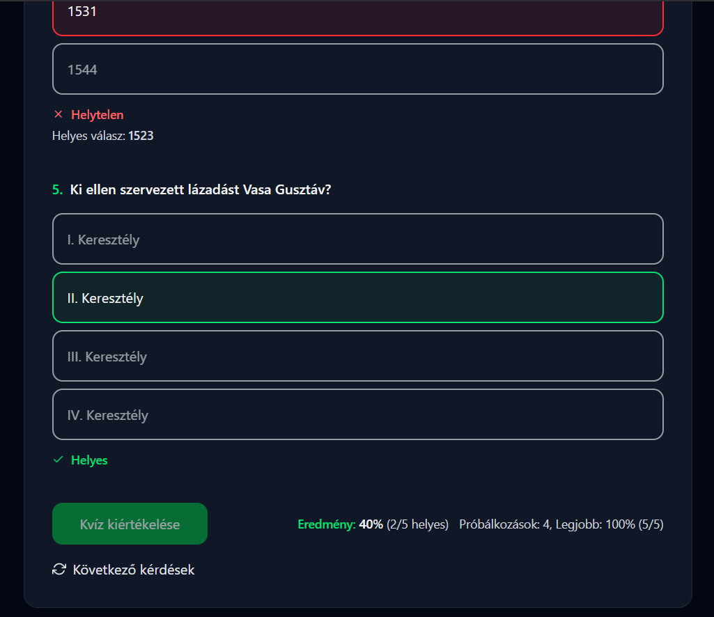

# StudyMate — AI Study Notes & Quizzes

Generate study notes and quizzes from your text using AI.

StudyMate is a full-stack web application where users can paste study material, generate summarized notes using AI, and practice with automatically generated quizzes.


---

# Preview

### Login

Simple authentication with JWT-based session handling.



### Create Note

Paste your study material and generate structured notes and quiz questions.



### Notes

View and manage all your saved notes.



### Quiz

Practice with generated quizzes and track your performance.



---

# Features

* User authentication with **JWT access and refresh tokens**
* Create and manage personal study notes
* AI-generated summaries using **Google Gemini**
* Automatic quiz generation from notes
* Quiz results tracking (cumulative attempt stats, best score with tie-break)
* Rate limiting on AI endpoints to prevent API abuse
* Light / dark theme (persisted)

---

# Tech Stack

### Frontend

* React 19
* Vite
* React Router
* Tailwind CSS

### Backend

* Node.js
* Express
* MongoDB (Mongoose)

### AI Integration

* Google Gemini API

### Authentication

* JWT (Access + Refresh tokens)

---

# Setup

## Clone the repository

```
git clone <repo-url>
cd StudyMate
```

---

## Backend setup

```
cd study-mate-backend
npm install
```

Create environment variables:

```
cp .env.example .env
```

Edit `.env` and set:

```
MONGO_URI=your_mongodb_connection
JWT_SECRET=your_secret
GEMINI_API_KEY=your_gemini_key
```

Start the backend:

```
npm run dev
```

Backend runs at:

```
http://localhost:3000
```

---

## Frontend setup

In a separate terminal:

```
cd study-mate-frontend
npm install
npm run dev
```

Frontend runs at:

```
http://localhost:5173
```

The Vite dev server proxies `/api` requests to the backend.

---

# Project Structure

```
StudyMate/
├ study-mate-frontend/
├ study-mate-backend/
├ screenshots/
├ README.md
└ ARCHITECTURE.md
```

Detailed system diagrams are available in:

```
ARCHITECTURE.md
```

---

# Environment Variables

Backend requires the following variables:

| Variable       | Description                        |
| -------------- | ---------------------------------- |
| MONGO_URI      | MongoDB connection string          |
| JWT_SECRET     | Secret used for signing JWT tokens |
| GEMINI_API_KEY | Google Gemini API key              |

See:

```
study-mate-backend/.env.example
```

---

# Notes

* AI endpoints (`/api/ai/generate`, `/api/ai/quiz`) use **rate limiting** to protect the Gemini API from abuse.
* The application uses **token refresh logic** to maintain user sessions securely.
